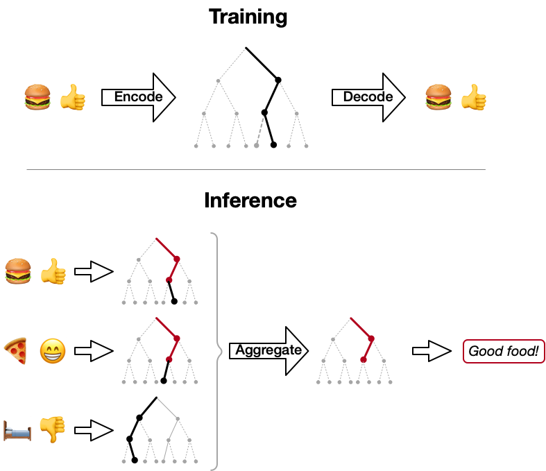

# [Hercules: Attributable and Scalable Opinion Summarization](#)



Code for the paper "[Attributable and Scalable Opinion Summarization](#)", Hosking et al. (ACL 2023).

By representing sentences from reviews as paths through a discrete hierarchy, we can generate abstractive summaries that are informative, attributable and scale to hundreds of input reviews.


## Setup

Create a fresh environment:
```
conda create -n herculesenv python=3.9
conda activate herculesenv
```
or
```
python3 -m venv herculesenv
source herculesenv/bin/activate
```

Then install dependencies:
```
pip install -r requirements.txt
```

Download data/models:
 - [Space](http://tomho.sk/hercules/data/data_space.zip) -> `./data/opagg/`
 - [AmaSum](http://tomho.sk/hercules/data/data_amasum.zip) -> `./data/opagg/`
 - [Trained checkpoints](http://tomho.sk/hercules/models/) -> `./models`

Tested with Python 3.9.

## Evaluation with trained models

```
torchseq --test --load ./models/hercules_space/
```

or

see [`./examples/Space-Eval.ipynb`](examples/Space-Eval.ipynb)

or 

```python
from torchseq.utils.model_loader import model_from_path
from torchseq.metric_hooks.hrq_agg import HRQAggregationMetricHook

model_slug = 'hercules_space' # Which model to load?

instance = model_from_path('./models/' + model_slug, output_path='./runs/', data_path='./data/', silent=True)

scores, res = HRQAggregationMetricHook.eval_generate_summaries_and_score(instance.config, instance, test=True)

print("Model {:}: Abstractive R2 = {:0.2f}, Extractive R2 = {:0.2f}".format(model_slug, scores['abstractive']['rouge2'], scores['extractive']['rouge2']))
```

## Training from scratch

```
torchseq --train --validate --config ./configs/hercules_space.json
```

## Training on a new dataset

Filter, generate pairs

Train model

```
torchseq --train --validate --config ./configs/{your_config}.json
```

## Citation